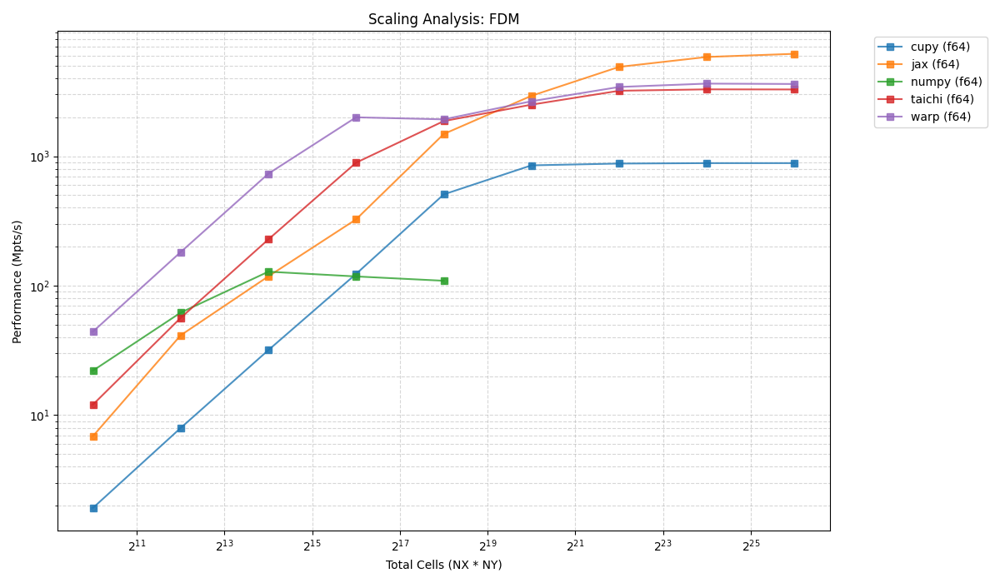
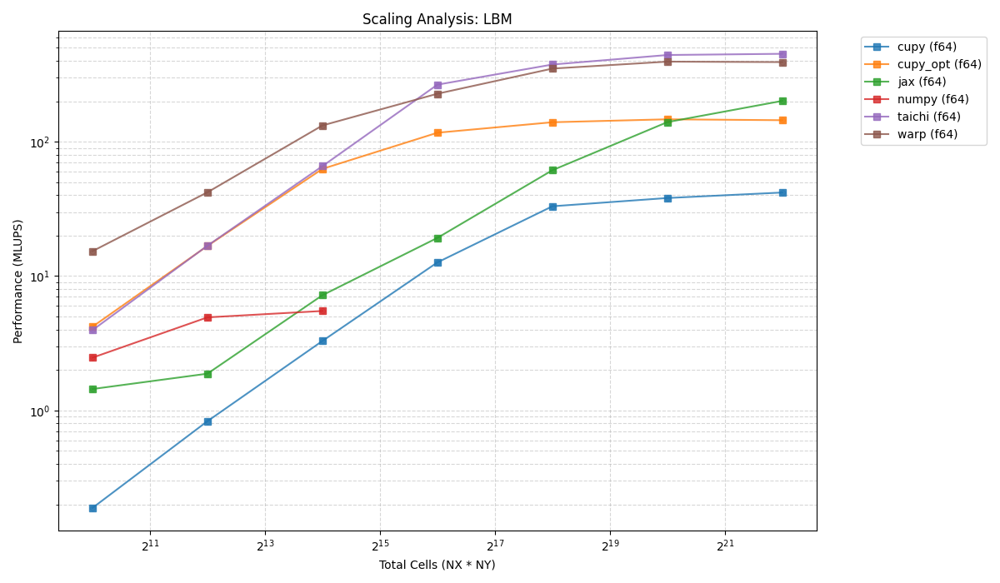

A comprehensive benchmarking suite to compare the performance of Python (NumPy, CuPy, JAX, Warp, Taichi) and **Julia** backends for scientific computing tasks: Lattice Boltzmann Method (LBM) and Finite Difference Method (FDM).

Latest results: 05.02.2026



## Requirements
- Python 3.10+
- CUDA Toolkit 12.x
- Python Dependencies: `pip install -r requirements.txt`
- Julia 1.9+ (Optional, for Julia benchmarks)

### Julia Environment Setup
To run the Julia backends, install the required packages:
```bash
julia -e 'using Pkg; Pkg.add(["StaticArrays", "CUDA", "HDF5"])'
```

## Usage

Run benchmarks using `main.py`:

```bash
python main.py --benchmark lbm --backend cupy --nx 1024 --ny 1024 --iterations 2000 --output-json result.json
```

### Options
- `--benchmark`: `lbm` or `fdm`
- `--backend`: `numpy`, `cupy`, `cupy_opt`, `jax`, `warp`, `taichi`
- `--nx`, `--ny`: Grid dimensions (default: 512)
- `--iterations`: Number of simulation steps (default: 1000)
- `--precision`: `f32` or `f64` (default: `f64`)
- `--output-json`: (Optional) Path to save results in JSON format for scaling analysis.

## Julia Benchmarks

The project includes an optimized Julia implementation for the LBM benchmark, supporting Serial, Multi-threaded, and GPU execution.

Run the Julia benchmark:
```bash
# Serial (Float32 by default)
julia benchmarks/lbm/lbm_d2q9.jl

# Multi-threaded (Float64)
julia -t 8 benchmarks/lbm/lbm_d2q9.jl --precision f64

# Custom grid and iterations
julia benchmarks/lbm/lbm_d2q9.jl --nx 1024 --ny 1024 --iterations 500
```

The Julia implementation (fused CUDA kernel) achieved **~400 MLUPS** on GPU, outperforming several Python-based backends.

Use the provided shell script to automate performance measurements across all backends:

```bash
chmod +x run_benchmarks.sh
./run_benchmarks.sh [NX] [NY] [ITERATIONS] [PRECISION]
```

> [!TIP]
> The script is flexible with its 3rd and 4th arguments. You can pass a precision string (e.g., `f32`) as the third argument to use default iterations, or specify both:
> - `./run_benchmarks.sh 512 512 f32` (Uses 1024 iterations at f32)
> - `./run_benchmarks.sh 128 128 100 f64` (Uses 100 iterations at f64)

### Structured Results
The script generates a session-based directory in `results/bench_YYYYMMDD_HHMMSS/` containing:
- Individual `.json` files for each backend/benchmark combination.
- Verbose `.log` files for each run (capturing backend-specific initialization and errors).
- A consolidated `summary.json` containing an array of all results.

## Scaling Analysis & Plotting

You can visualize scaling performance across different grid sizes and backends using the standalone analysis tool:

```bash
python core/analysis.py --dir results --output scaling_latest
```

### Features:
- **Auto-Aggregation**: Scans all subdirectories in `results/` to build a comprehensive view of performance.
- **Robust Visualization**: Automatically handles multiple precisions (`f32` vs `f64`) and aggregates multiple runs for the same grid size (showing mean lines and individual data points).
- **Automation**: The `run_benchmarks.sh` script calls this tool automatically at the end of every run, generating `scaling_latest_lbm.png` and `scaling_latest_fdm.png` in the project root.

## Backend Consistency
All backends (NumPy, CuPy, JAX, Warp, Taichi) are standardized to update macroscopic variables (`rho`, `ux`, `uy`) at the end of each simulation step ($t+1$), ensuring numerical consistency when comparing results across different implementations.

## Profiling with NVIDIA Nsight Systems
For deep performance analysis, use `nsys`:
```bash
nsys profile -o profile_output python main.py --benchmark lbm --backend warp
```
The codebase includes NVTX ranges to help identify specific sections in the timeline.
